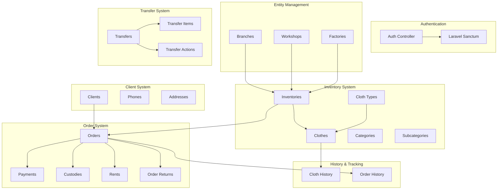
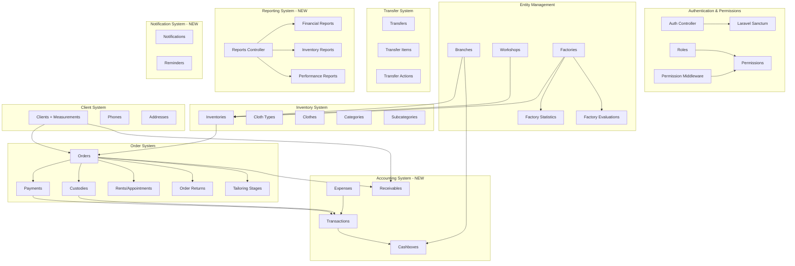
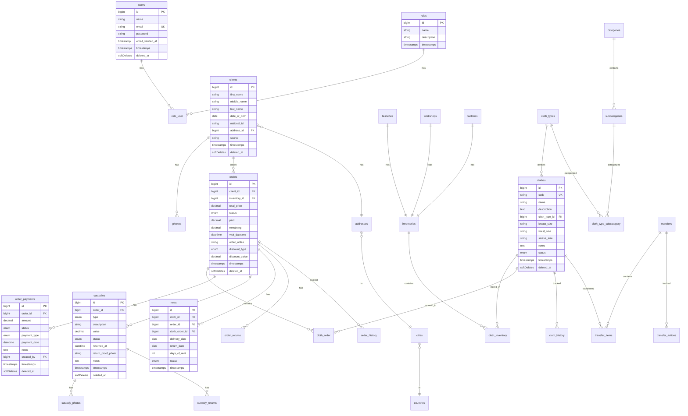
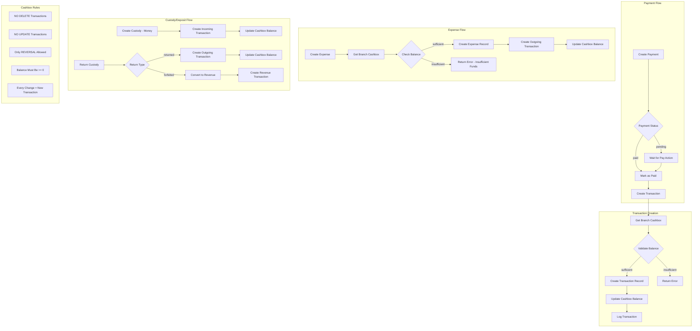
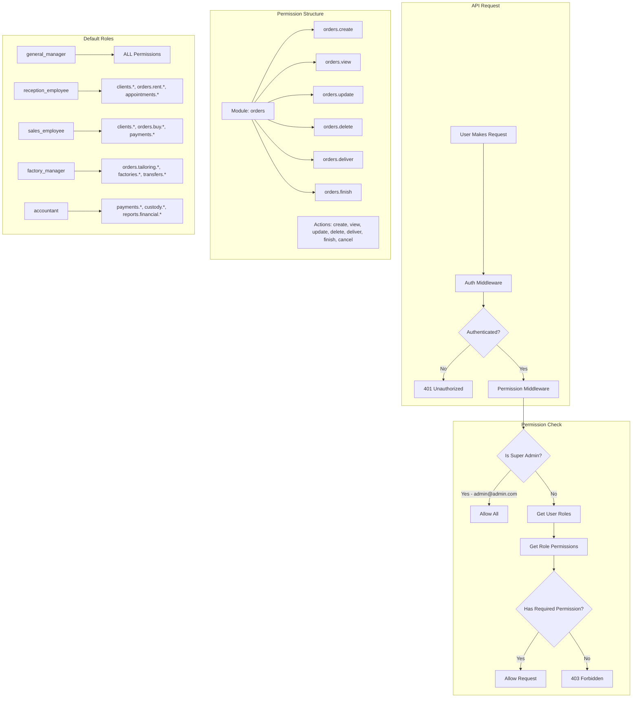
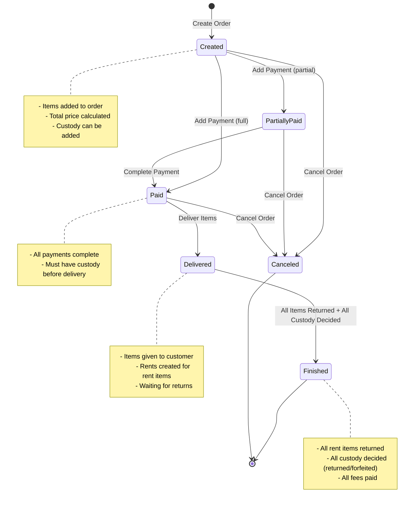
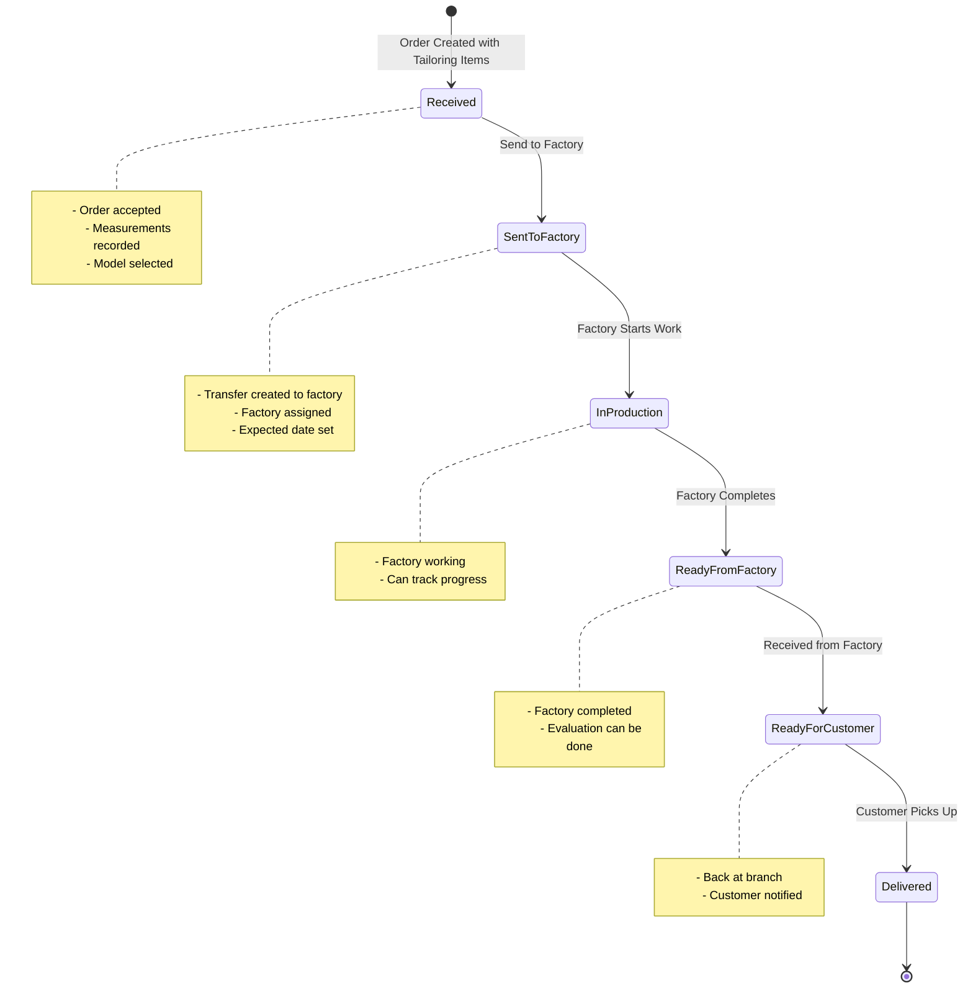
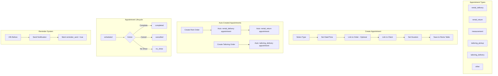
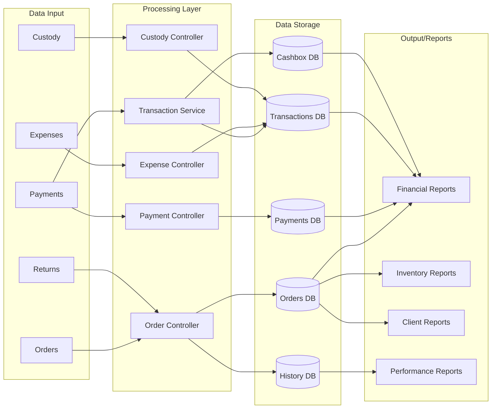

# Architecture Diagrams - Atelier Management System

## Table of Contents
1. [Current System Architecture](#current-system-architecture)
2. [Planned System Architecture](#planned-system-architecture)
3. [Database Schema - Current](#database-schema---current)
4. [Database Schema - Planned Additions](#database-schema---planned-additions)
5. [Accounting Module Flow](#accounting-module-flow)
6. [Permissions System Flow](#permissions-system-flow)
7. [Order Lifecycle](#order-lifecycle)
8. [Appointment/Scheduling Flow](#appointmentscheduling-flow)

---

## Current System Architecture



---

## Planned System Architecture



---

## Database Schema - Current



---

## Database Schema - Planned Additions

```mermaid
erDiagram
    permissions ||--o{ permission_role : assigned
    roles ||--o{ permission_role : has
    
    branches ||--|| cashboxes : has
    cashboxes ||--o{ transactions : contains
    
    order_payments ||--o{ transactions : creates
    expenses ||--o{ transactions : creates
    custodies ||--o{ transactions : creates
    
    clients ||--o{ receivables : owes
    orders ||--o{ receivables : generates
    
    users ||--o{ notifications : receives
    
    factories ||--o{ factory_evaluations : evaluated
    orders ||--o{ factory_evaluations : generates

    permissions {
        bigint id PK
        string name UK
        string description
        string module
        string action
        timestamps timestamps
    }
    
    permission_role {
        bigint permission_id FK
        bigint role_id FK
    }
    
    cashboxes {
        bigint id PK
        bigint branch_id FK UK
        decimal current_balance
        decimal opening_balance
        datetime last_transaction_at
        timestamps timestamps
    }
    
    transactions {
        bigint id PK
        bigint cashbox_id FK
        enum type
        decimal amount
        decimal balance_after
        string reference_type
        bigint reference_id
        string description
        bigint branch_id FK
        bigint user_id FK
        timestamps timestamps
    }
    
    expenses {
        bigint id PK
        bigint branch_id FK
        enum type
        decimal amount
        date expense_date
        text description
        text notes
        bigint created_by FK
        timestamps timestamps
        softDeletes deleted_at
    }
    
    receivables {
        bigint id PK
        bigint client_id FK
        bigint order_id FK
        decimal total_amount
        decimal paid_amount
        decimal remaining_amount
        date due_date
        enum status
        text notes
        timestamps timestamps
        softDeletes deleted_at
    }
    
    notifications {
        bigint id PK
        bigint user_id FK
        enum type
        string title
        text message
        string reference_type
        bigint reference_id
        datetime read_at
        enum priority
        timestamps timestamps
    }
    
    factory_evaluations {
        bigint id PK
        bigint factory_id FK
        bigint order_id FK
        decimal quality_rating
        int completion_days
        boolean on_time
        text notes
        bigint evaluated_by FK
        datetime evaluated_at
        timestamps timestamps
    }

    clients_additions {
        string breast_size
        string waist_size
        string sleeve_size
        string hip_size
        string shoulder_size
        string length_size
        text measurement_notes
        date last_measurement_date
    }

    rents_additions {
        enum appointment_type
        string title
        text description
        enum appointment_status
        boolean reminder_sent
        datetime reminder_sent_at
        int duration_minutes
    }

    orders_additions {
        enum tailoring_stage
        datetime tailoring_stage_changed_at
        date expected_completion_date
        bigint assigned_factory_id
        text factory_notes
    }
```

---

## Accounting Module Flow



---

## Permissions System Flow



---

## Order Lifecycle



---

## Tailoring Order Stages



---

## Appointment/Scheduling Flow (Extended Rents)



---

## Data Flow Summary



---

## Summary

These diagrams show:
1. **Current State**: What's already built
2. **Planned State**: What needs to be added
3. **Data Flows**: How data moves through the system
4. **Business Logic**: Order lifecycle, permissions, accounting rules

The most critical additions are:
1. **Accounting Module** - Cashbox + Transactions (immutable log)
2. **Permissions System** - Full RBAC
3. **Extended Rents** - Appointments/Scheduling
4. **Reports** - Business intelligence


