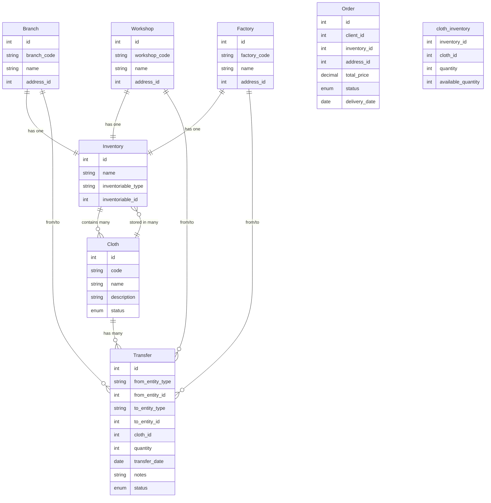
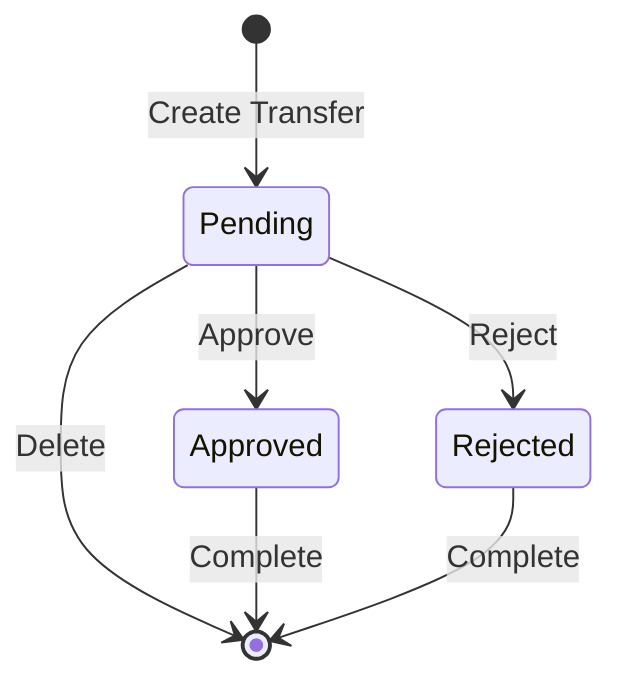
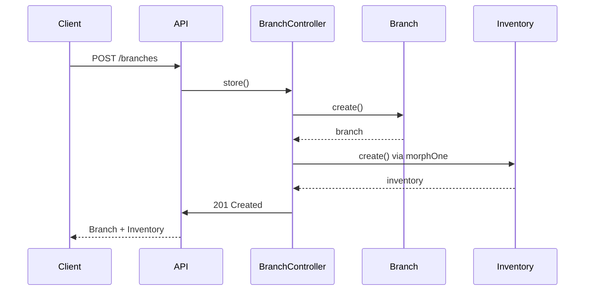
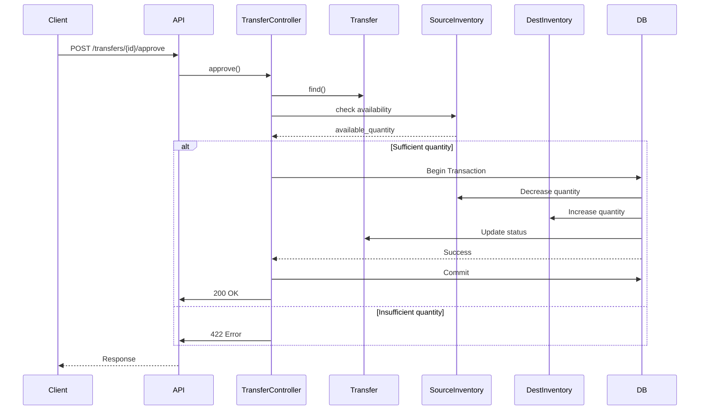

# System Architecture Documentation

## Overview

This document provides a comprehensive overview of the Bahaa-Eldin Inventory Management System architecture, focusing on the inventory management, entity relationships, and transfer workflow.

## System Purpose

The system manages clothing inventory across multiple entities (branches, workshops, and factories). Each entity has its own inventory that stores clothes, and the system supports transferring clothes between entities with an approval workflow.

## Core Entities

### 1. Branches, Workshops, and Factories

These are the three main entity types in the system:

- **Branches**: Retail locations that rent clothes to clients
- **Workshops**: Production/repair facilities
- **Factories**: Manufacturing facilities

**Common Attributes:**
- Unique code (branch_code, workshop_code, factory_code)
- Name
- Address (via address_id foreign key)

**Key Relationship:**
- Each entity has exactly **one inventory** (one-to-one relationship via polymorphic association)

### 2. Inventories

Inventories are storage containers for clothes. Each inventory belongs to exactly one entity (branch, workshop, or factory).

**Attributes:**
- Name
- Polymorphic relationship to entity (inventoriable_type, inventoriable_id)

**Key Relationship:**
- Belongs to one entity (Branch, Workshop, or Factory) via polymorphic relationship
- Has many clothes through `cloth_inventory` pivot table

### 3. Clothes

Clothing items that can be stored in inventories and rented to clients.

**Attributes:**
- Code (unique)
- Name
- Description
- Sizes (breast_size, waist_size, sleeve_size)
- Status (damaged, burned, scratched, ready_for_rent, rented, die)
- Notes

**Key Relationships:**
- Belongs to many inventories (via `cloth_inventory` pivot table)
- Has quantity and available_quantity in each inventory
- Has many transfers (transfer history)

### 4. Transfers

Records of clothing movements between entities.

**Attributes:**
- From entity (polymorphic: Branch/Workshop/Factory)
- To entity (polymorphic: Branch/Workshop/Factory)
- Cloth reference
- Quantity
- Transfer date
- Notes
- Status (pending, approved, rejected)

**Key Relationships:**
- Polymorphic relationship to source entity (fromEntity)
- Polymorphic relationship to destination entity (toEntity)
- Belongs to one cloth

## Entity Relationship Diagram



## Polymorphic Relationships

The system uses Laravel's polymorphic relationships to allow inventories to belong to different entity types:

### Inventory → Entity (Polymorphic)

```php
// Inventory Model
public function inventoriable()
{
    return $this->morphTo();
}

// Branch/Workshop/Factory Models
public function inventory()
{
    return $this->morphOne(Inventory::class, 'inventoriable');
}
```

**Database Structure:**
- `inventories.inventoriable_type`: Stores the model class name (e.g., "App\Models\Branch")
- `inventories.inventoriable_id`: Stores the entity ID

### Transfer → Entity (Polymorphic)

Transfers use polymorphic relationships for both source and destination:

```php
// Transfer Model
public function fromEntity()
{
    return $this->morphTo('fromEntity');
}

public function toEntity()
{
    return $this->morphTo('toEntity');
}
```

**Database Structure:**
- `transfers.from_entity_type` / `transfers.from_entity_id`
- `transfers.to_entity_type` / `transfers.to_entity_id`

## Inventory System Architecture

### Inventory Creation

When a branch, workshop, or factory is created, an inventory is automatically created:

1. Entity is created (Branch/Workshop/Factory)
2. System automatically creates associated Inventory
3. Inventory is linked via polymorphic relationship

**Example Flow:**
```
POST /api/v1/branches
{
  "branch_code": "BR-001",
  "name": "Downtown Branch",
  "address": {
    "street": "Tahrir Square",
    "building": "2A",
    "city_id": 1,
    "notes": "Next to the bank"
  }
}

→ Address automatically created from address details
→ Branch created with address_id
→ Inventory automatically created with name "Downtown Branch Inventory"
→ Inventory linked to Branch via polymorphic relationship
```

### Cloth Storage

Clothes are stored in inventories through the `cloth_inventory` pivot table:

**Pivot Table Fields:**
- `inventory_id`: Reference to inventory
- `cloth_id`: Reference to cloth
- `quantity`: Total quantity in inventory
- `available_quantity`: Available quantity (not rented/transferred)

**Key Rules:**
- A cloth can exist in multiple inventories
- Each inventory-cloth combination has its own quantity
- `available_quantity` ≤ `quantity` (available cannot exceed total)

## Transfer Workflow

### Transfer Lifecycle



### Transfer Process

1. **Create Transfer (Status: Pending)**
   - User creates transfer request
   - System validates:
     - Source and destination are different
     - Entities exist and have inventories
     - Cloth exists in source inventory
     - Sufficient available_quantity in source
   - Transfer saved with status "pending"

2. **Approve Transfer**
   - System validates transfer is still pending
   - System checks availability again
   - If valid:
     - Decrease `quantity` and `available_quantity` in source inventory
     - Increase `quantity` and `available_quantity` in destination inventory
     - If cloth doesn't exist in destination, create new pivot record
     - Update transfer status to "approved"
   - All operations in database transaction

3. **Reject Transfer**
   - System validates transfer is pending
   - Update status to "rejected"
   - No inventory changes

### Transfer Validation Rules

- Source and destination must be different entities
- Both entities must exist
- Both entities must have inventories
- Cloth must exist in source inventory
- Source must have sufficient `available_quantity`
- Only pending transfers can be updated/deleted
- Only pending transfers can be approved/rejected

## Data Flow Diagrams

### Creating an Entity with Inventory



### Transfer Approval Flow



## Database Schema Summary

### Key Tables

1. **branches** - Branch entities
2. **workshops** - Workshop entities
3. **factories** - Factory entities
4. **inventories** - Inventory storage (polymorphic owner)
5. **clothes** - Clothing items
6. **cloth_inventory** - Pivot table (inventory contents)
7. **transfers** - Transfer records (polymorphic entities)

### Polymorphic Columns

- `inventories.inventoriable_type` / `inventoriable_id`
- `transfers.from_entity_type` / `from_entity_id`
- `transfers.to_entity_type` / `to_entity_id`

### Indexes

- Polymorphic relationships are indexed for performance
- Unique constraints on entity codes (branch_code, workshop_code, factory_code)
- Unique constraint on cloth.code

## Business Rules

1. **One Inventory Per Entity**: Each branch/workshop/factory has exactly one inventory
2. **Automatic Inventory Creation**: Inventories are created automatically when entities are created
3. **Transfer Validation**: All transfers must be validated before approval
4. **Atomic Operations**: Transfer approvals use database transactions
5. **Status Management**: Only pending transfers can be modified
6. **Quantity Tracking**: System tracks both total and available quantities

## Security Considerations

- All endpoints require authentication (Sanctum)
- Soft deletes for entities (data preservation)
- Validation at multiple levels (request, business logic)
- Transaction safety for critical operations

## Future Enhancements

Potential improvements to consider:

1. Transfer approval workflow with multiple approvers
2. Transfer scheduling (future-dated transfers)
3. Bulk transfers (multiple clothes in one transfer)
4. Inventory alerts (low stock notifications)
5. Transfer history analytics and reporting
6. Inventory reconciliation features

